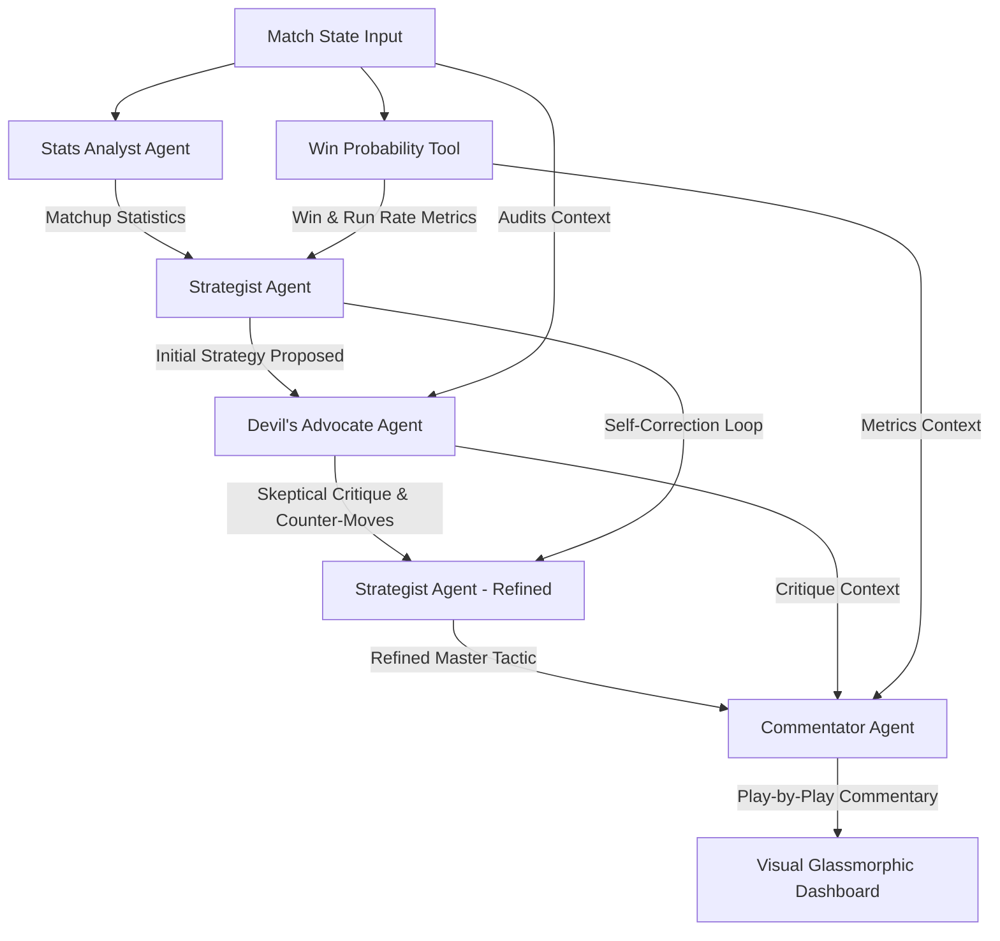

# 🏏 Captain Cool: Multi-Agent IPL Cricket Strategy System

**Captain Cool** is an advanced, multi-agent tactical simulation platform designed to devise high-probability strategies for critical match overs in the Indian Premier League (IPL). Powered by **Google Gemini 2.5 Flash** (via the modern `@google/genai` Node.js SDK), the system mimics a elite coaching panel—complete with data scientists, master tactical minds, skeptical auditors, and theatrical broadcasters.

---

## 🚀 Key Features

* **Dual Mode Execution**: Connects seamlessly to Google Gemini API using the new `@google/genai` SDK. If no API key is present, it automatically triggers an intelligent, high-fidelity **local simulation fallback** to guarantee a fully interactive out-of-the-box demo!
* **Multi-Agent Critique Loop**: Creates a closed-loop debate where the *Strategist* proposes a plan, the *Devil's Advocate* attacks it for vulnerabilities and tail-risks, and the *Strategist* is re-invoked to deliver a hardened, refined final plan.
* **Premium Glassmorphic Web Dashboard**: A dark-mode HTML5/CSS3 single-page application served via **Express** featuring smooth visual transitions, real-time win probability gauges, CRR vs RRR indicators, and step-by-step agent outputs.
* **Legendary Presets**: Pre-loaded with three classic high-tension IPL scenarios:
  1. *IPL 2019 Final Last Over Drama* (CSK vs MI - Malinga vs Shardul & Jadeja)
  2. *The Spin Crucible* (SRH vs GT - Heinrich Klaasen vs Rashid Khan)
  3. *King Kohli Death Chase* (RCB vs MI - Virat Kohli & Dinesh Karthik vs Jasprit Bumrah)

---

## 📐 System Architecture

The following diagram illustrates the multi-agent coordination workflow managed by the `orchestrator.js`:



### The 4 Specialized Agents
1. **Stats Analyst (`agents/statsAnalyst.js`)**: Queries historical player records, strike rates vs. pace/spin, death overs performance, and direct head-to-head match-up indices to expose mathematical advantages.
2. **Strategist (`agents/strategist.js`)**: The "brain" (inspired by MS Dhoni). Formulates initial overs strategies (bowling rotations, aggression levels, field setups).
3. **Devil's Advocate (`agents/devilsAdvocate.js`)**: The skeptical auditor. Evaluates the strategist's proposal for unstated assumptions, extreme tail-risks (e.g. wet ball from dew), and opponent counters.
4. **Commentator (`agents/commentator.js`)**: The voice of the match. Translates the deep technical strategies and debates into a theatrical, high-voltage play-by-play broadcast script.

---

## 📁 Directory Structure

```text
captain-cool/
├── agents/
│   ├── statsAnalyst.js       # Analyzes matchup stats and player form indices
│   ├── strategist.js         # Mastermind ("Captain Cool") decision maker (initial & refined rounds)
│   ├── devilsAdvocate.js     # Identifies tail-risks and opponent counter-moves
│   └── commentator.js        # Translates strategy into a legendary commentary stream
├── tools/
│   ├── cricketStats.js       # High-fidelity player database and matchup engines
│   └── winProbability.js     # Mathematical T20 win probability calculator
├── public/
│   └── index.html            # Premium glassmorphic web dashboard
├── orchestrator.js           # Coordinates the multi-agent feedback loop
├── matchState.js             # Scenario manager, validator, and text formatters
├── index.js                  # Express HTTP Server & API endpoints
├── .env                      # API Key configuration
├── .gitignore                # Safe Git file ignore specifications
└── package.json              # Project dependencies & startup scripts
```

---

## 🛠️ Installation & Setup

### 1. Prerequisites
Make sure you have [Node.js (v18+)](https://nodejs.org/) installed.

### 2. Install Dependencies
Navigate to the `captain-cool` directory and install the packages:
```bash
cd captain-cool
npm install
```

### 3. Configure Gemini API Key (Optional)
Open the `.env` file in the root directory and add your Google Gemini API Key:
```env
GEMINI_API_KEY=your_gemini_api_key_here
PORT=3000
```
> [!NOTE]
> If you do not provide a `GEMINI_API_KEY`, the application will seamlessly fall back to a high-fidelity local simulation, allowing you to experience the full dashboard and agent mechanics immediately!

---

## 🏃 Running the Application

To launch the Express server and open the web dashboard:

```bash
npm start
```

### View the Dashboard
Open your browser and navigate to:
**[http://localhost:3000](http://localhost:3000)**

### 📊 Using the Dashboard
1. Select one of the pre-loaded legendary scenarios from the dropdown menu (e.g. *IPL 2019 Final*).
2. The form will automatically populate with that scenario's live score, wickets, batsman, bowler, and recent deliveries.
3. Click the glowing **Generate Strategic Over Plan** button.
4. Watch the progress bar advance through the analysis stages as the agents debate.
5. Review the resulting Win Probabilities, CRR vs RRR metrics, and the step-by-step agent card outputs, finished off with a thrilling radio broadcast commentary!
